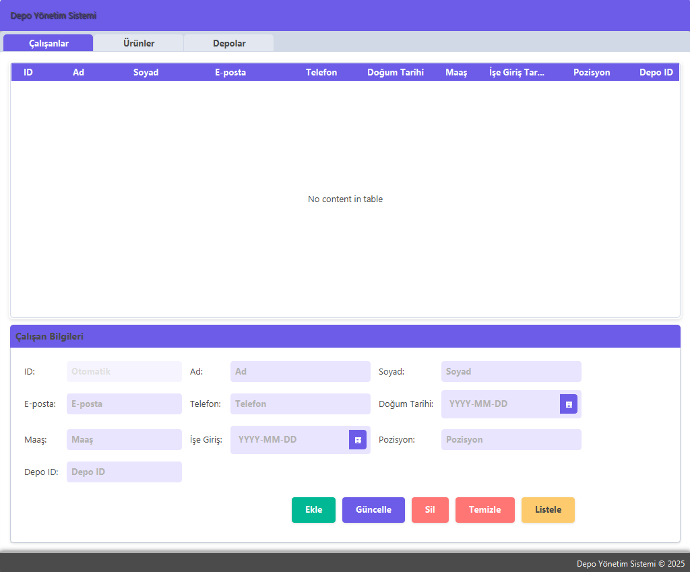

#  Depo ve Lojistik Yönetim Sistemi

Bu proje, **JavaFX** ve **MySQL** kullanarak geliştirilmiş bir **Depo ve Lojistik Yönetim Sistemi**dir. Sistem, **çalışanları, ürünleri ve depoları** yönetmek için bir masaüstü uygulaması sağlar.

##  Özellikler

 **Çalışan Yönetimi**  
- Çalışan ekleme, listeleme, güncelleme ve silme  
- Çalışanların depo atamalarını yapma  



 **Ürün Yönetimi**  
- Ürün ekleme, listeleme, güncelleme ve silme  
- Ürünlerin depolar ile ilişkilendirilmesi  


 **Depo Yönetimi**  
- Depo ekleme, listeleme, güncelleme ve silme  
- Depo kapasitesini ve yöneticisini belirleme  


 **Modern Arayüz**  
- Kullanıcı dostu **JavaFX** tabanlı UI  
- **CSS** ile özelleştirilmiş şık tasarım  

---

##  Kullanılan Teknolojiler

- **Java 17+**  
- **JavaFX** (FXML ile tasarım)  
- **MySQL** (JDBC ile bağlantı)  
- **Scene Builder** (FXML UI tasarımı için)  

---

##  Kurulum

### Gerekli Bağımlılıkları Yükleyin  
- **Java** yüklü olmalıdır. [Java JDK 17](https://www.oracle.com/java/technologies/javase/jdk17-archive-downloads.html)  
- **MySQL** yükleyin ve bir veritabanı oluşturun.  

###  MySQL Veritabanı Kurulumu  
1. Aşağıdaki sorguları kullanarak MySQL'de bir veritabanı oluşturun:  

```sql
CREATE DATABASE management_system;

USE management_system;

CREATE TABLE employees (
    id INT AUTO_INCREMENT PRIMARY KEY,
    first_name VARCHAR(50),
    last_name VARCHAR(50),
    email VARCHAR(100),
    phone VARCHAR(20),
    date_of_birth DATE,
    salary DOUBLE,
    hire_date DATE,
    position VARCHAR(50),
    warehouse_id INT
);

CREATE TABLE products (
    id INT AUTO_INCREMENT PRIMARY KEY,
    name VARCHAR(100),
    category VARCHAR(50),
    price DOUBLE,
    quantity INT,
    supplier VARCHAR(100),
    added_date DATE,
    warehouse_id INT
);

CREATE TABLE warehouse (
    id INT AUTO_INCREMENT PRIMARY KEY,
    name VARCHAR(100),
    location VARCHAR(100),
    capacity INT,
    created_at DATE,
    manager VARCHAR(100),
    phone VARCHAR(20)
);
```

2. `DatabaseHelper.java` dosyasındaki aşağıdaki satırı MySQL bilgilerinize göre güncelleyin:  

```java
static String URL = "jdbc:mysql://localhost:3306/management_system";
static final String USER = "root"; // MySQL Kullanıcı Adı
static final String PASSWORD = "12345"; // MySQL Şifresi
```

---

##  Projeyi Çalıştırma

Projeyi çalıştırmak için aşağıdaki adımları takip edin:

###  **MySQL Sunucusunu Başlatın**
Öncelikle **MySQL veritabanınızın çalıştığından emin olun.**  
Terminal veya CMD üzerinden şu komutları kullanabilirsiniz:

```bash
mysql -u root -p
```

### **Projeyi Derleyin ve Çalıştırın**

#### Terminal Kullanarak Çalıştırma

```bash
javac -d out --module-path "javafx-sdk/lib" --add-modules javafx.controls,javafx.fxml src/org/example/managementsystem/*.java
java --module-path "javafx-sdk/lib" --add-modules javafx.controls,javafx.fxml -cp out org.example.managementsystem.App
```

#### IDE Kullanarak Çalıştırma  
- **IntelliJ IDEA / Eclipse / VS Code** gibi bir IDE kullanıyorsanız:  
  - `App.java` dosyasını açın.  
  - **Run** butonuna basarak uygulamayı çalıştırın.  


---

##  Geliştirici Notları

- **Hata Ayıklama**:  
  - Hata mesajlarını görmek için `System.err.println` kullanılmıştır.  
  - `Alert` kutuları ile kullanıcıya hata mesajları gösterilir.  

- **Veri Kontrolleri**:  
  - Tarih alanları boş bırakılırsa hata verir.  
  - Maaş ve depo kapasitesi gibi alanlara sadece **sayi girilmesi** gerekir.  

- **Veritabanı Bağlantısı**:  
  - `DatabaseHelper` sınıfı MySQL bağlantısını yönetir.
 

---

##  İletişim

Proje ile ilgili sorularınız ve destekleriniz için benimle iletişime geçebilirsiniz.   

